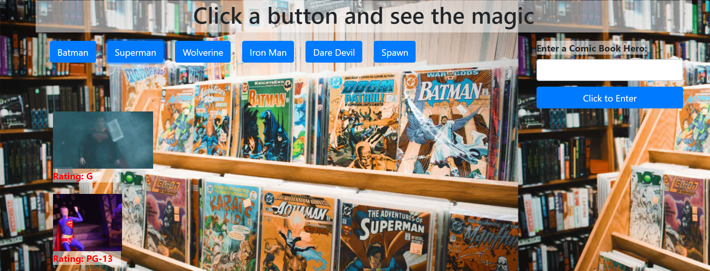

# Ajax-Gif

Background Photo by Lena Orwig on Unsplash

## Overview

Using the GIPHY API I made a dynamic web page that populates with gifs of your choice. To complete the page I used JavaScript and jQuery to change the HTML.

